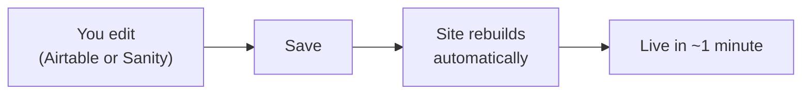

# Client Guide
_Last verified: 2026-07-28_

> Written for [client name], in plain language. Read top to bottom once; keep for reference forever.

## Your two bookmarks
1. **[Airtable base link]** — your menu, hours, and reservation requests. It's a friendly spreadsheet.
2. **[Sanity Studio link]** — where you write blog posts and edit the story page.

## What happens when you hit save
The site rebuilds itself and your change is live in about a minute. That's it. No one needs to be called.

## What to edit freely
- Add, edit, or hide menu items (use the **Available** checkbox to hide — don't delete)
- Change prices, descriptions, photos, hours
- Write, edit, and publish blog posts

## What not to touch (kindly)
- **Don't rename or delete columns/fields** in Airtable, or change the blog's structure in Sanity. The site trusts the shelf's shape — renaming a field is remodeling the shelf while the shopper's mid-aisle. Content changes are yours; structure changes go through [developer name].

## Reservation requests
New requests appear in the **Requests** table. Between services: check the table, text or email the guest to confirm, then tick **Confirmed** for your own records.

## Who to contact
- Content questions or "I broke something": [developer name] — [contact]
- The site looks down: check [status page/steps from Incident Recipes], then contact [developer]
