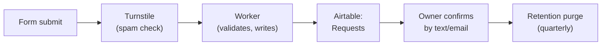

# Data Map & Retention
_Last verified: 2026-07-28_

> Every piece of visitor data: where it lands and when it gets purged.
> This table is the living version of the privacy policy's backbone (`privacy-legal.md`).

| Data | Collected where | Lands where | Kept how long | Purge owner |
|---|---|---|---|---|
| Reservation requests (name, contact, date, party size) | Reserve form | Airtable **Requests** table | [90 days] after visit date | [who], quarterly |
| Analytics | Every page | Cloudflare Web Analytics (cookieless) | Per Cloudflare | — automatic |
| [Contact form messages] | [Contact form] | [where] | [how long] | [who] |

## Reservation data flow

## The rules
- **Minimum collection:** every form field is a promise made to a stranger. New fields require updating this map *first*.
- **Deletion requests:** honored within [30] days — this table is the checklist of where to look.
- **Quarterly purge:** [first week of each quarter], delete Requests older than [90 days]. Log the date here: [last purge: YYYY-MM-DD]
