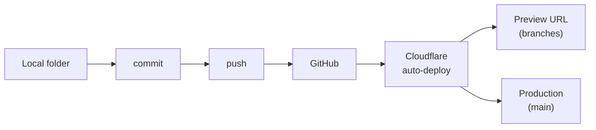

# Dev Guide
_Last verified: 2026-07-28_

> For future-you, or whoever inherits this build. Assumes the skills from *Idea to Launch* (fglabs.co).

## Repo map
```
CLAUDE.md        project memory — read it first, every session
context/         the Context File Pack — the project's standing rules
src/             pages, layouts, components
public/          assets served as-is
```

## Local setup from zero
1. Install Node, Git, Claude Code, Wrangler ([current install guide in the book's companion repo])
2. `git clone [repo]` → `cd [project]` → `npm install`
3. `npm run dev` — local preview
4. Open a Claude Code session; it reads `CLAUDE.md` automatically. Confirm it lists the context files before doing anything.

## Environment variables (names & purposes — **values live in the vault + Cloudflare, never here**)
| Name | Purpose |
|---|---|
| `AIRTABLE_READ` | Read-only key, Menu base |
| `AIRTABLE_WRITE` | Write-only key, Requests table (Worker only) |
| `SANITY_TOKEN` | Read published content |
| `TURNSTILE_SECRET` | Form bot-check verification (Worker only) |

## Deploy runbook
Push to `main` = deploy. Branches get preview URLs. Nothing else to remember.



- **Roll back:** revert to the last good commit and push. Every deploy maps to a commit.
- **Content republish:** deploy hooks fire on Airtable/Sanity saves — no manual step.

## Standing rules (enforced by the Pack)
Build-time content only · scoped keys only · one change per prompt · verify then commit · every feature ships its states per `nuances.md`
