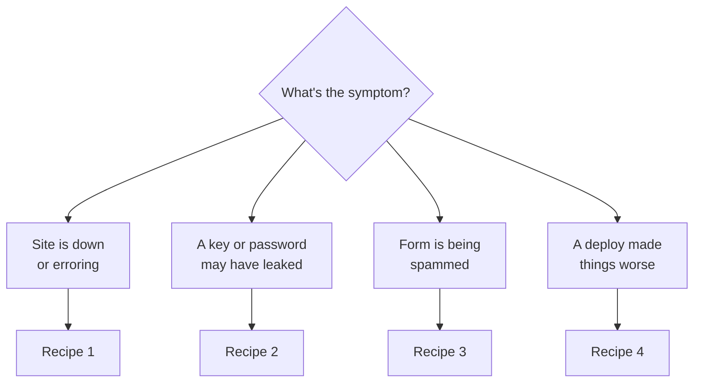

# Incident Recipes
_Last verified: 2026-07-28_

> Step-by-step fixes, written calmly *before* anything was on fire.

## Something broke — start here

## Recipe 1 — Site down
1. Is it just you? Check from a phone on cellular.
2. Cloudflare status page: [link]. If Cloudflare is down, wait — nothing to fix.
3. Cloudflare dashboard → deployments: did the last deploy fail? Read the build log.
4. Paste the log into Claude Code: *"Diagnose before proposing fixes."*
5. Worst case: roll back — revert to last good commit, push.

## Recipe 2 — Key leaked (or might have)
1. **Rotate first, investigate second.** Issue a new key at the service, update the Cloudflare/Worker env var, kill the old key.
2. Deleting a file does NOT unleak a key — the repo history remembers.
3. Update the vault entry (new created-date in the name) and the Accounts page here.
4. Ask Claude Code to scan repo history for any other secrets while you're in there.

## Recipe 3 — Form spam
1. Confirm Turnstile is active (Cloudflare dashboard) and the honeypot field still exists in the form.
2. Check the Worker's rate limiting; tighten if needed.
3. Bulk-delete junk rows in Airtable; note the date/volume here for pattern-spotting.

## Recipe 4 — Bad deploy
1. Don't debug live. Revert to the last good commit, push — site restored in ~a minute.
2. Reproduce the problem on a branch; fix it behind a preview URL.
3. Merge only after the preview passes on your actual phone.

**After any incident:** update this page with what happened and what changed. Ten minutes, while it's fresh.
