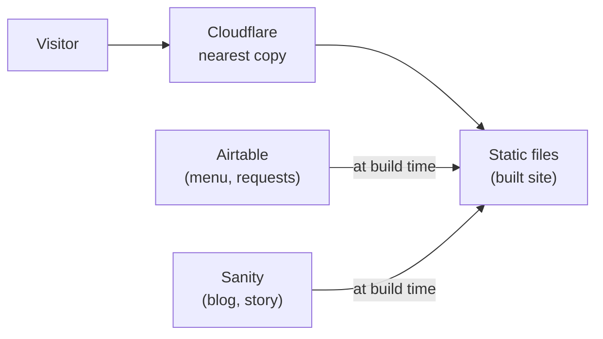

# Site Overview
_Last verified: 2026-07-28_

> Replace the bracketed bits with your project's facts. If it isn't written down, it isn't maintained.

**What this site is:** [One paragraph. e.g., "The public website for Marisol's Kitchen, a family-run Oaxacan restaurant — menu, hours, story, blog, and a reservation-request flow."]

**Who it's for:** [Audience from your project-brief.md]

**Domain:** `[yourdomain.com]` — registered at [registrar], renews [month/year], renewal price checked annually (calendar reminder exists: [yes/no])

**The stack in one paragraph:** [Framework] generates static files. Content lives in Airtable ([what]) and Sanity ([what]) and is pulled in at build time. The repo lives on GitHub; pushing to `main` auto-deploys to Cloudflare. Forms are caught by a small Cloudflare Worker and written to Airtable.

## Site architecture

## Key facts
| Fact | Value |
|---|---|
| Live URL | [https://yourdomain.com] |
| Repo | [github.com/you/project] (private) |
| Hosting | Cloudflare Workers static assets, Git-connected |
| This handbook | [handbook URL], protected by [Cloudflare Access / Worker password] |
